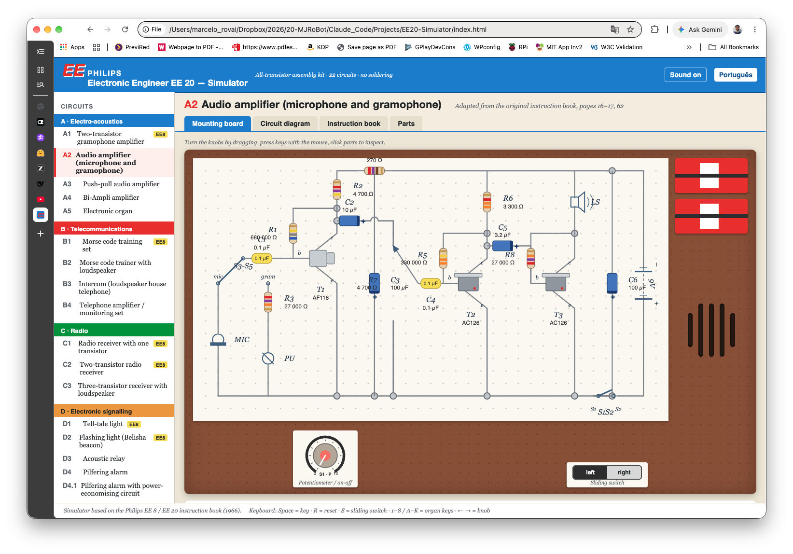
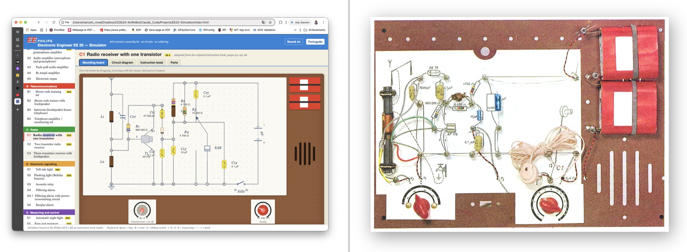

A couple of years ago, I heard Massimo Banzi, the founder of Arduino, talk about how he fell in love with electronics as a child in Italy while playing with a kit. It was the Lectron: little magnetic blocks you snapped onto a metal plate to build a circuit, designed in Germany in the mid-sixties. "I learned electronics with this kit when I was 7," Banzi said, "and it gave me also a great appreciation for design as well."

That took me straight back to my own.

## Christmas, 1970

I was 11 and had spent two years looking at that box in a shop window in my Brazilian hometown, Osasco, in São Paulo. That year my parents finally had the money for it. Not Santa Claus. My parents.

The box was an "**Engenheiro Eletrônico Philips**", the EE 20, which is how the kit was always known in Brazil. Inside: a brown pegboard, a bag of springs, two rolls of wire, one AF 116 germanium transistor, two AC 126s, a ferrite rod, a lamp, and a book with 22 circuits to build. Banzi had magnets. I had springs. Neither of us needed a soldering iron, which is probably why our parents said yes.

## What I noticed going back to the book

Philips designed the EE series in Eindhoven in the early sixties and kept the line going into the eighties, ending with the EE 3000. The first kits existed to sell Philips components to people who liked electronics. By the end of the decade, the purpose had shifted: make teenagers curious enough to go and study the subject.

My Brazilian edition was printed in São Paulo by Colibri Litografia in 1968, two years before it reached me. Reading the back cover now is like reading a different country. It lists Philips branches in Guanabara, Pôrto Alegre and Recife. Guanabara ceased to be a state in 1975. The text still carries the accents the 1971 spelling reform removed: rêde, sôbre, êste. The last line reads "Conte com PHILIPS para aprender melhor", count on Philips to learn better.

The circuits were serious. A three-transistor receiver with a ferrite rod you rotated to null out a station. A Morse trainer. An intercom. A burglar alarm. An eight-key electronic organ you tuned by ear on the potentiometer. Half the book was theory, and it never talked down to the kid reading it.

## Rebuilding it

So, with help from technology 60 years younger than the kit, I rebuilt it. All 22 circuits now run in a browser.

**[▶ Play online](https://mjrovai.github.io/EE20-Simulator/sim/)** · [Project page](https://mjrovai.github.io/EE20-Simulator/) · [Source on GitHub](https://github.com/Mjrovai/EE20-Simulator)



It is free, works in English and Portuguese, runs offline, and includes both original manuals as PDFs.

## What is simulated

| Group | Circuits | Behavior |
|---|---|---|
| A · Electro-acoustics | A1 earphone amplifier, A2 mic/gramophone amplifier, A3 push-pull, A4 Bi-Ampli, A5 electronic organ | Record player with public-domain tunes and vinyl crackle; microphone, real or simulated, with acoustic feedback howl when it gets near the loudspeaker; bass and treble split across two loudspeakers; 8-key organ whose resistor tolerance makes each build slightly different |
| B · Telecommunications | B1/B2 Morse trainers, B3 intercom, B4 telephone amplifier | Morse key by mouse or spacebar, with a decoder of your own keying; an automatic "friend" sends text at a chosen speed; intercom talk and listen with a remote room; pick-up coil hearing a telephone, bird-song, a whisper, a watch ticking |
| C · Radio | C1 one-, C2 two-, C3 three-transistor receivers | Medium wave from 520 to 1620 kHz with eight simulated transmitters, tuning selectivity and static, ferrite-rod direction finding that nulls when the rod points at the transmitter, outside aerial, trawler band, sunrise alarm with the LDR |
| D · Signaling | D1 tell-tale light, D2 flashing beacon, D3 acoustic relay, D4/D4.1 pilfering alarms, D5 burglar alarm | LDR light model with room light, torch and hand cover; latching lamps with a reset key; RC-timed flashing; a relay triggered by a clap, a door slam or your real microphone; window and door contacts |
| E · Measuring & control | E1 night light, E2 moisture indicator, E3 time switch, E4 measuring bridge | Lamp brightness from the LDR divider with a sensitivity control; sensing wires on a pencil line, damp paper, your hands, a flower pot, water, a diode; timer with stopwatch and calibration; bridge with a mystery component you find by nulling the knob |

Every circuit has four tabs.

- **Mounting board.** The wiring card with photo-style parts: color-banded resistors, yellow polyester and blue electrolytic capacitors, the AF 116 and AC 126 with heat sink, the LDR, the lamp holder, the batteries and the loudspeaker grille. Click any part to inspect it.
- **Circuit diagram.** The blue Philips-style schematic, live. Conducting transistors light up, keys and wiper and slide switch move, the lamp glows.
- **Instruction book.** Description, assembly notes, use, how it works and applications, adapted from the original, plus the Morse table and the fault-finding checklist.
- **Parts.** Component list with resistor color codes.

The instruments are there too: lamp, loudspeakers, earphone, a battery gauge showing voltage and current, an oscilloscope for the audio signal or the slow lamp trace, a stopwatch and the station list. The batteries slowly run down, exactly as they did in 1970, and you fit fresh ones when they do.



## Fault-finding practice

This is my favorite part, and it comes straight from the book's chapter on *localização de defeitos*.

On the board tab, "Practice fault-finding" hides one assembly mistake: a reversed transistor or electrolytic, a wrong resistor, a diode the wrong way round, a loose wire, a dead lamp, flat batteries. The set then misbehaves the way the book says it will. You inspect the parts, find the fault, and repair it. It is the only part of the original experience that a photograph of a kit can never give you.

Keyboard shortcuts: `Space` for the Morse or alarm key, `R` to reset, `S` for the sliding switch, `1`–`8` or `A S D F G H J K` for the organ, and the arrow keys for the potentiometer.

## Notes on fidelity

Circuit topologies follow the schematics in the "Description of circuits" chapter, pages 62 to 72. Component values were read from the wiring-card photographs wherever the book shows them, which is the case for A1, A5, B3, C1, D1, D4.1 and E1. For the other circuits, the values are plausible choices from the kit's own parts list, which runs from 47 Ω to 680 kΩ for resistors and covers 47 nF, 0.1 µF, 3.2 µF, 10 µF and 100 µF for capacitors. The potentiometer is the kit's 10 kΩ logarithmic type with an on/off switch.

The simulation is behavioral rather than a SPICE solver. It models RC time constants, LDR resistance against light, divider thresholds, and transistor on/off states. Sound is synthesized using the Web Audio API, and the loudspeaker and the earphone have their own frequency coloring. The transmitters, the telephone voices, the bird-song, and the automatic "friend" are all synthetic, and the music is public-domain melodies.

## Run it offline

The simulator is plain HTML, CSS, and JavaScript. No build step, no dependencies, no network connection once you have it. Download the [offline zip](https://mjrovai.github.io/EE20-Simulator/download/EE20-Simulator-offline.zip), about 80 KB, unpack it, and open `sim/index.html`. Sound needs one click on the page first, because of the browser autoplay rule, and the microphone is optional and only requested if you tick the box for it.

If your browser blocks scripts on local files, serve the folder with any static web server:

```bash
cd EE20-Simulator/sim
python3 -m http.server 8080
```

## The instruction books

Both editions are on the project page as scanned PDFs: the [English color edition](https://mjrovai.github.io/EE20-Simulator/books/EE20-colour-en.pdf) and the [Brazilian edition](https://mjrovai.github.io/EE20-Simulator/books/EE20-br.pdf). They are © Philips and are shared for historical and educational purposes only, for the benefit of collectors, teachers and hobbyists of a kit that has been out of production for decades.

## How it was built

The code was generated by Claude Fable 5.1 (Anthropic), working from the two scanned manuals, under my direction. A 1966 kit rebuilt by a 2026 model, from the same book I read as a boy.

That is worth stating plainly, because the interesting part is not that a model can write JavaScript. It is that the source material was a scanned book with no text layer in two languages, with the component values legible only in photographs of the wiring cards. Getting from that to 22 working circuits is mostly a research problem, and the research is what I directed.

The simulator code is released under the MIT license and the repository is public, so anyone who owned one of these can check my work and tell me where the model and I got it wrong.

## Sources and method

The historical details come from the books themselves. The Brazilian back cover carries the printer and year, Colibri Litografia in São Paulo, 1968, along with the branch list that includes Guanabara. The English edition is copyrighted in Eindhoven, 1966, printed in the Netherlands. The parts lists in both editions list the transistor types, the OA 79 diode, the 10 kΩ logarithmic potentiometer, the ferroxcube rod, the two AD 3316 CZ loudspeakers, and the 22 wiring cards for the EE 20, against 8 for the EE 8.

Radiomuseum dates the EE 20 to 1963 through 1965 and describes it as "8 plus 22 experiments". The account of the EE series shifting from component promotion to education comes from [kranenborg.org](https://www.kranenborg.org/electronics/25-philips-ee-electonic-experimentation-kits/). Banzi's words about the Lectron are quoted from [this collection of Lectron material](https://giulianopz.github.io/arduino-lectron-system-2000). The Lectron itself was invented by Georg Franz Greger, patented in Germany in 1965, marketed by Egger-Bahn from 1966 and by Braun from 1967.

---

*If you had one of these, which circuit did you build first? I would like to know.*
