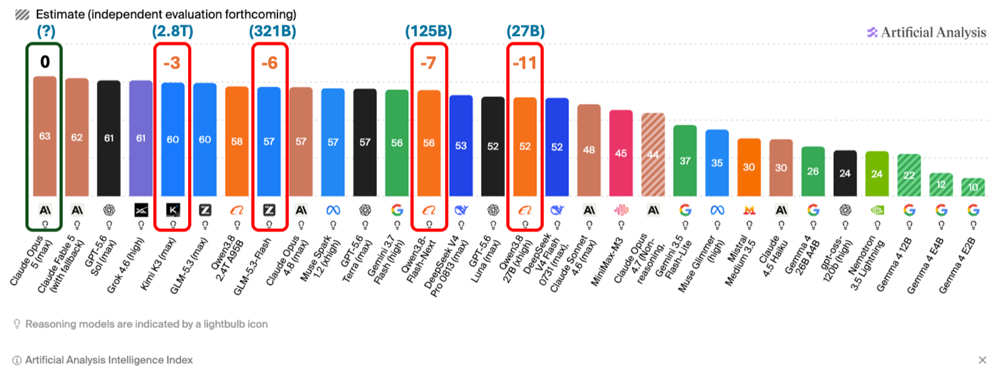
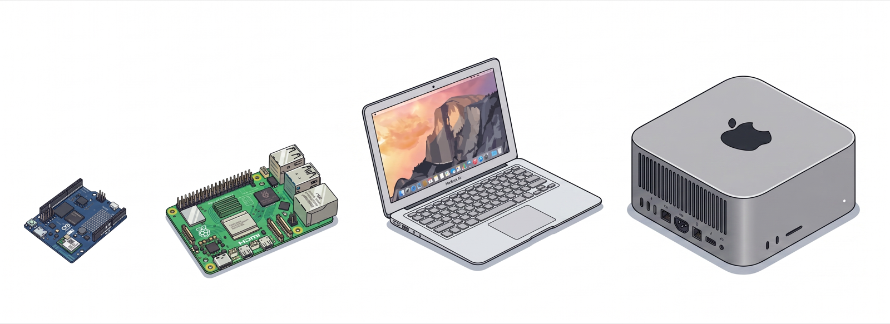
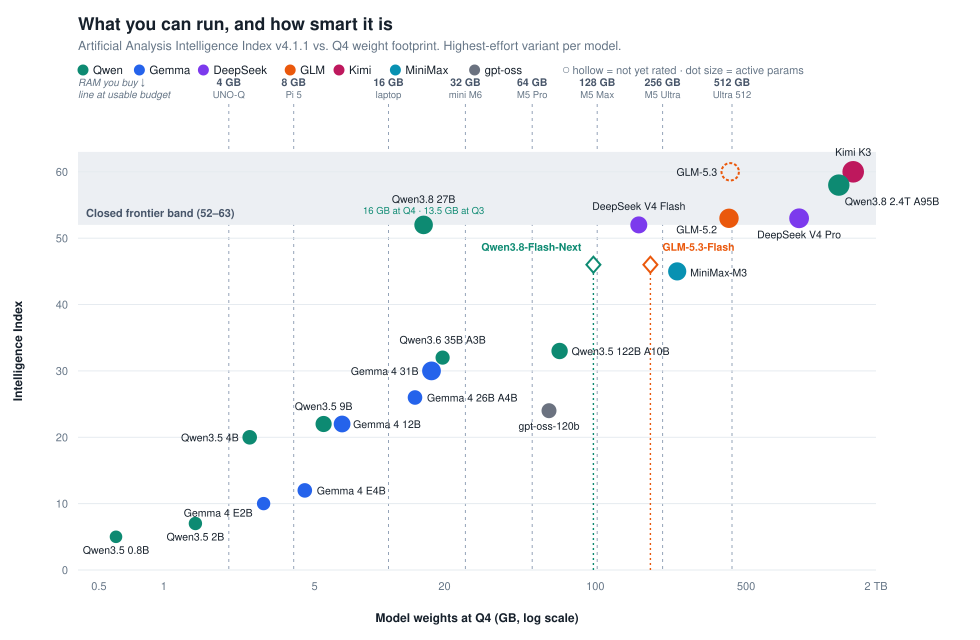
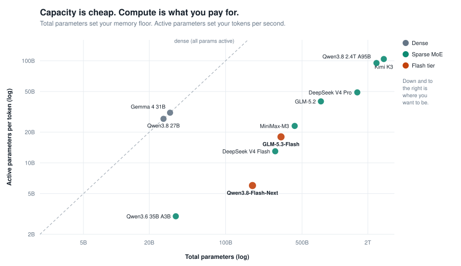
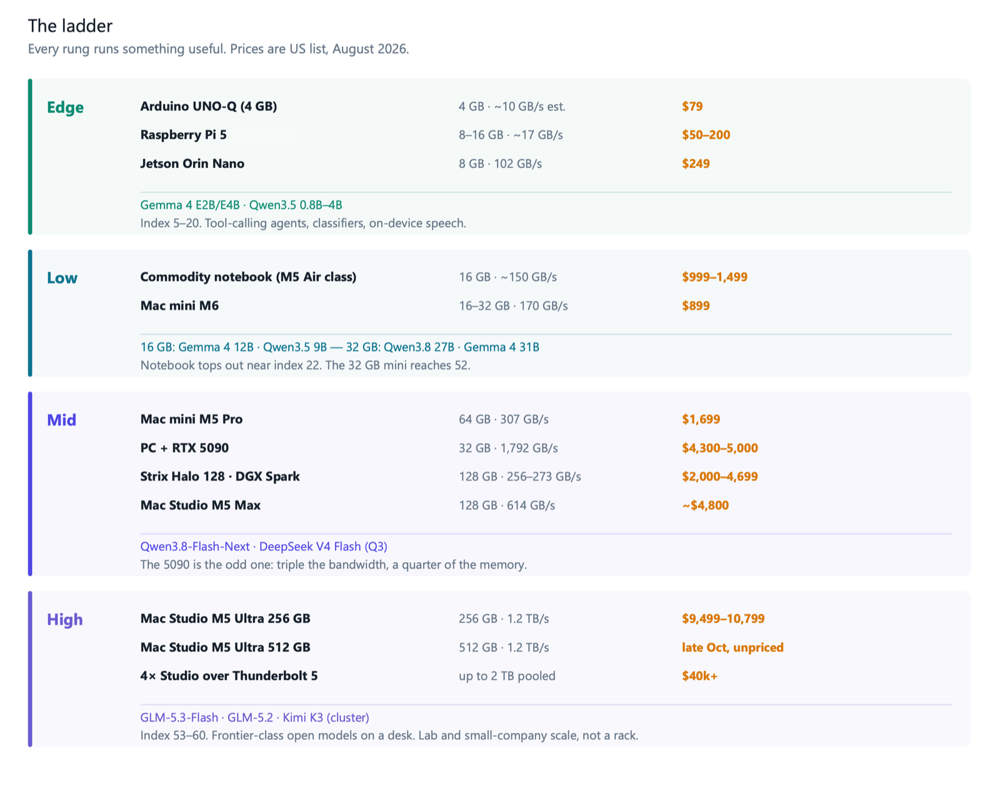
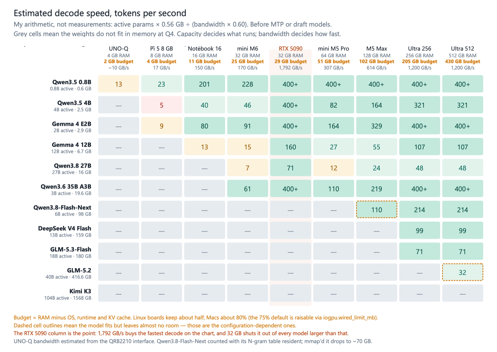

$10,799. One box on a desk, drawing about as much power as a couple of light bulbs. Inside it: GLM-5.3-Flash, 321 billion parameters, multimodal, one-million-token context, scoring 84.3 on Terminal-Bench 2.1 against Claude Opus 4.8's 85.0.

**No API key. No rate limit. No per-token bill. Nothing leaving the room.**

The machine shipped this week. The model shipped yesterday. Three points on the Artificial Analysis index now separate the best model anyone sells from the best model anyone can download. Six points separate it from the best one that fits on a machine you can order this afternoon.

For about three years, the honest answer to "can I run a good model locally?" was: sort of, if you lower your expectations. You ran a 7B, then a 13B, then a 30B, and each time you told yourself it was fine for the task at hand. Sometimes that was true. Mostly you were trading capability for control and pretending the trade was free.

That's over. Not because local models got better, but because two things happened in the same couple of weeks: Apple shipped desktop silicon with matrix accelerators in every GPU core, and Alibaba, DeepSeek and Z.ai released open-weight models that hit frontier-class benchmarks with single-digit or low-double-digit active parameter counts.

Let's be careful here and look at numbers.

## The gap, measured

Three points separate Claude Opus 5 from Kimi K3 (a 2.8 Trillion MoE model). Six points separate Opus 5 from GLM 5-3 Flash (a 321 Billion MoE model). Seven points separate Opus 5 from Qwen3.8 Flash Next (a 125-billion-parameter model, the future Qwen 4 architecture). Eleven points separate Opus 5 from Qwen3.8 27B, **a dense model that fits in a desktop, at the border of frontier models.**

Two caveats. The [Intelligence Index](https://artificialanalysis.ai/leaderboards/models?weights=proprietary%2Copen&size=large%2Cunknown%2Ctiny%2Csmall%2Cmedium) is a composite, and it flattens what matters — whether a model stays coherent across four hundred tool calls, for one. And Kimi K3 is 2.8 trillion parameters: open weights and runnable are not the same word.

Runnable is the real question.

## What you can actually run

The dashed lines represent usable model budget, not nameplate RAM — a 4 GB UNO-Q gives you about 2 GB once Debian and the KV cache take their share, and an 8 GB Pi 5 gives you about 4 GB. Everything to the left of a line fits. Capacity only; nothing here says anything about speed.

Look at where Qwen3.8 27B sits: index 52, 13.5 GB at Q3 or 16 GB at Q4, inside the frontier band, just left of the Mac mini M6 line (16 GB version runs Q3; 32 GB version runs Q4). A desktop comfortably runs a model that scores higher (with no quantization) than GPT-5.6 Luna or Claude Opus 4.7. Of course, with Q4 or Q3, it will lose some quality, but it will still work pretty well.

And look at the cluster between the Pi 5 and notebook lines — Gemma 4 E4B, Qwen3.5 9B, Gemma 4 12B. That band is the sweet spot for a laptop, and until this year it was empty.

Now look at the right side. DeepSeek V4 Pro at index 53 needs 880 GB. Kimi K3 at index 60 needs about 1.5 TB. Getting from 52 to 60 costs roughly 100 times as much memory. That curve is brutal, and it's the single most important thing on the chart.

## Why the curve is bending

Mixture-of-Experts split one number into two. Total parameters set your memory floor — every expert has to stay addressable whether or not it fires. Active parameters set your token rate. The 2025 generation pushed total parameters up and left active parameters high: GLM-5.2 activates 40B, DeepSeek V4 Pro 49B, Kimi K3 104B.

### The models released on 25 and 26 August 2026 move in the opposite direction

**[GLM-5.3-Flash](https://artificialanalysis.ai/models/glm-5-3-flash)** is 321B total with 18B active, multimodal, 1M context, hybrid KDA linear attention with sparse MLA. Z.ai claims it beats GLM-5.2 across the board at a tenth the price, and puts it at 84.3 on Terminal-Bench 2.1 against Claude Opus 4.8's 85.0.

**[Qwen3.8-Flash-Next](https://artificialanalysis.ai/models/qwen3-8-flash-next)** is stranger and, for our purposes, more interesting. 125B main parameters, 6B active, plus a 51B N-gram embedding block — a 20-million-entry bigram/trigram lookup table sitting at layer 2. Qwen's own model card says the quiet part directly: embeddings scale parameters with less computation and are *more amenable to offloading than MoE*, which makes them efficient for memory-constrained accelerators. That table is a gather, not a matmul. Near-zero bandwidth per token, and a natural candidate for mmap off an SSD.

Qwen's reported numbers, against my current daily driver and against Opus 4.6:

| | Flash-Next (6B active) | Qwen3.8 27B | Claude Opus 4.6 Max |
|---|---|---|---|
| DeepSWE 1.1 | **58.7** | 42.2 | — |
| SWE-bench Pro | **62.5** | 61.7 | 53.4 |
| SWE-bench Multilingual | **81.0** | 73.8 | 77.5 |
| CoWorkBench | **73.9** | 70.7 | 68.2 |
| JobBench | **55.7** | 33.4 | 36.6 |
| GPQA Diamond | **91.7** | 89.2 | 91.3 |
| HLE | 35.9 | 30.8 | **40.0** |

Vendor-reported, self-harnessed, and neither model has an independent Intelligence Index score yet. Treat the table as a hypothesis. But if even half of it survives third-party evaluation, a 6B-active model is doing work that needed a 40B-active model in June.

## What changed in the Macs

Apple's marketing says **memory bandwidth.** That's not the story.

Unified memory has given the GPU full bandwidth since M1 — an M3 Ultra already had 819 GB/s, more than an RTX 4090, and still did prompt processing badly. Apple Silicon was never bandwidth-starved. It was compute-starved: plenty of bytes per second, not enough matmul throughput. That's why decode felt fine and prefill felt like waiting for a bus.

M5 puts Neural Accelerators inside every GPU core. Apple claims up to 4× the prompt-processing throughput of M3 Ultra in LM Studio, and 4.3× the peak AI compute. Bandwidth going to 1.2 TB/s is a 1.5× bump and secondary. The prefill number is what turns a 100k-token repository from a coffee break into a workflow.

Bandwidth on two of these machines is tied to a box you have to tick, which the headline figures hide:

| | Memory | Bandwidth | Price (US) |
|---|---|---|---|
| Mac mini M6 | 16 GB | 153 GB/s | $899 |
| Mac mini M6 | 24–32 GB | 170 GB/s | ~$1,099–1,299 |
| Mac mini M5 Pro | 24 GB | 307 GB/s | $1,699 |
| Mac mini M5 Pro | 64 GB | 307 GB/s | ~$2,700 |
| Mac Studio M5 Max | 36 GB, 32-core GPU | 460 GB/s | $2,499 |
| Mac Studio M5 Max | 128 GB, 40-core GPU | 614 GB/s | ~$4,800 |
| Mac Studio M5 Ultra | 96 GB | **1.2 TB/s** | $5,499 |

The M6 splits at the memory tier: 16 GB runs at 153 GB/s, and only 24 GB or more reaches 170. The M5 Max's 614 GB/s requires the 40-core GPU upgrade, so the $2,499 machine runs at 460. The M5 Pro supports 307 GB/s across all configurations, and the Ultra supports 1.2 TB/s across all configurations. If you are buying to run models, bandwidth deserves as much attention as core count, and on two of these it is an upgrade rather than a spec.

The Ultra's memory pricing is where it hurts. Going 96 → 256 GB costs $4,000, and the 80-core GPU adds $1,300, so a 256 GB Ultra lands at $10,799. The 512 GB configuration ships in late October with no announced price. Buying in other countries, such as Chile rather than the US, adds IVA and import margin on top. **But it is doable for a small company to invest in a machine that sits on a table and runs frontier models privately with almost no extra cost after it, except energy, which is not that much on an Apple machine.** 

## The ladder

Nothing on that ladder is a toy. That's the part I did not expect to be writing in 2026.

## How fast, roughly

These are estimates from arithmetic, not measurements — active parameters times bytes, divided by achieved bandwidth at 60%. Take them as a shape, not a promise, and measure your own.

> For example, on a Raspberry Pi 5 with 8GB of RAM, I went from the 9 tok/s baseline to 13 tok/s when running a QAT-version model with MTP and llama.cpp ([Running Small Language Models on a Raspberry Pi 5: Gemma 4 E2B and Qwen3.5 4B with MTP](https://github.com/Mjrovai/EdgeML-with-Raspberry-Pi/tree/main/mtp-rasp))

The shape is still informative. Dense models punish low-bandwidth machines: Qwen3.8 27B on a Mac mini M6 lands around 7 tok/s, which is technically working and practically annoying. The same machine runs Qwen3.6 35B-A3B at roughly 61 tok/s because only 3B activate. On the Mac mini M5 Pro, Qwen3.8-Flash-Next fits only if the N-gram table is offloaded — resident, it needs about 98 GB; with the table mmap'd, closer to 70 GB.

Whether that offload actually works on Apple Silicon is, as far as I can tell, undemonstrated. It's the first thing I'd test.

## The low and mid tiers deserve more attention than they get

Most of the coverage this week is about the $10,799 Ultra. For the majority of us, we don't have ten thousand dollars to expend on one machine — the interesting machines are the cheap ones.

Start with the laptop already on the desk. A commodity notebook in the M5 Air class has 16 GB of unified memory at roughly 150 GB/s, which, after accounting for the OS and KV cache, leaves about 11 GB for weights. That lands you on **Gemma 4 12B at 6.7 GB or Qwen3.5 9B at 5.5 GB**, both around index 22, both running at 13 to 18 tok/s. Not frontier. Genuinely useful, on hardware nobody bought for AI, at zero marginal cost.

What 16 GB does *not* comfortably run is Qwen3.8 27B. That model is 16 GB at Q4 and still 13.5 GB at Q3, against an 11 GB budget, so it wants a 32 GB machine. That is not the $899 mini — that one has 16 GB and the slower 153 GB/s memory, and it lands in the same place as the laptop. The machine you want is the **32 GB Mac mini M6 at roughly $1,299**, which also happens to be the configuration that reaches 170 GB/s. There, index 52 sits inside the closed-frontier band for about the price of a good phone. The jump from index 22 to index 52 costs $400 of RAM and one tier of bandwidth. It is still the best value on the entire ladder.

The **Mac mini M5 Pro** holds 307 GB/s at every configuration, but $1,699 buys 24 GB, not 64. The 64 GB version is closer to $2,700, and that is the one that covers everything up to about 50 GB at Q4 and reaches Qwen3.8-Flash-Next if the N-gram table offloads.

### The 5090 is worth staring at

A PC with an RTX 5090 has 32 GB of GDDR7 at 1,792 GB/s — the fastest memory on this page, 1.5× the M5 Ultra and nearly 3× the M5 Max, in a card costing $4,300–5,000 on the street during the current shortage. On Qwen3.8 27B, it decodes at roughly 71 tok/s, compared to the Ultra's 48 and the M5 Max's 24.

Then it stops. Thirty-two gigabytes is thirty-two gigabytes. Qwen3.8-Flash-Next needs 98 GB; GLM-5.3-Flash needs 180. The 5090 does not run them at any speed, and neither do two of them without a tensor-parallel setup and a lot of patience.

That is the whole argument for unified memory in one comparison. The $1,299 Mac mini and the $4,500 GPU both have 32 GB. The GPU is about ten times faster on what fits. Which one you want depends entirely on whether the model you care about is under or over the line — and the models that got interesting this week are all over it.

The other 128 GB boxes fill the gap between the Strix Halo from roughly $2,000 to $4,349 depending on stock, and the DGX Spark at $4,699. Both offer capacity rather than speed: 256–273 GB/s versus the M5 Max's 614. The Spark's advantage is CUDA parity, which matters if your work has to move to cloud GPUs later. The Strix Halo's advantage is price and Windows. Neither has MLX.

## Edge is where this gets genuinely useful

Everything above assumes a desk and mains power. Down at the bottom of the ladder, the picture has also changed, and it changed quietly.

Gemma 4 E2B and E4B, and Qwen3.5 in its 0.8B through 4B sizes — these run comfortably on a Raspberry Pi 5 and an Orin Nano. Index scores of 5 to 20, which sounds dismissive until you remember what those numbers mean in practice: reliable instruction following, structured output, tool calls, on-device speech. **Not a research assistant. A component.**

The Arduino UNO-Q sits at the bottom of the ladder and is the one I have spent the most time with lately. Four gigabytes of LPDDR4 on a Dragonwing QRB2210, $79, and a real-time STM32 on the same board. I have been running Qwen3.5 0.8B and 2B on llama-server there with the OpenAI-compatible tools API for the [agentic chapter of the UNO-Q series](https://mjrovai.github.io/ARDUINO-UNO-Q/5-Agentic_AI/), and the thing that surprises people is that tool calling works — not fast, but correctly, on a board the size of an UNO R3 with an MCU handling the motors alongside it.

Qualcomm does not publish the QRB2210's memory bandwidth, and in the [product brief](https://docs.qualcomm.com/doc/87-61720-1/87-61720-1_REV_D_Qualcomm_Dragonwing_QRB2210_Processor_Product_Brief.pdf), the [full data sheet](https://mm.digikey.com/Volume0/opasdata/d220001/medias/docus/7554/QRB2210.pdf), and the [developer page](https://www.qualcomm.com/developer/hardware/arduino-uno-q), memory is described only in terms of interface geometry, never as a GB/s. As a result, the UNO-Q column in Figure 5 is an estimate from the LPDDR4X interface width. Treat it as a placeholder until measured.

Two things that matter more than the index at this tier:

**MTP speculative decoding.** I benchmarked this on a Pi 5 with Gemma 4 E2B and Qwen3.5 4B, and the gains are large enough to change which models are viable. Both new Flash-tier models ship MTP too — GLM-5.2 extended it to five draft tokens, and Qwen3.8-Flash-Next includes a 4B MTP layer. The technique scales from Pi to Ultra.

**Quantization-aware training (QAT).** Gemma 4 E2B QAT holds up at INT4 in a way that post-training quantization does not, and on an 8 GB Pi that difference decides whether the model is usable.

## What I would actually buy

If you already own a 16 GB laptop: run Gemma 4 12B or Qwen3.5 9B on it tonight and spend nothing. 

If you are buying under $1,500: **Mac mini M6, 32 GB, ~$1,299.** Index 52 for the price of a phone, on the configuration that also gets 170 GB/s.

If you are buying under $3,000: **Mac mini M5 Pro, 64 GB, ~$2,700.** Best local capability per dollar above the mini. Check the configurator before assuming $1,699 gets you there — it buys 24 GB.

If your work is CUDA-bound and your models fit in 32 GB: the 5090 will beat everything here on speed. If they do not fit, no amount of bandwidth helps.

If you need GLM-5.3-Flash at honest quantization: **Mac Studio M5 Ultra, 256 GB, $9,499–10,799.** That's the machine the 180 GB footprint asks for, with room left for KV cache.

> The 512 GB Ultra has lost its reason to exist (at least so far), and it lost it two days after launch. It was the part you needed for GLM-5.2 or DeepSeek V4 Pro at Q4. Both have now been matched or beaten by models a fifth and a twentieth of their size. Paying somewhere north of $14,000 to run a 744B model that scores 53 while a 321B model that scores higher fits in a $10,799 box is not a decision I can defend.
>

## What it costs, and who it makes sense for

The API is cheap, and it is not going away. Any honest version of this article says so.

Against GLM-5.2's pricing of $1.40 / $4.40 per million tokens, a heavy agent workload of 10M input and 2M output per day runs about $8,400 a year, and a $10,799 Ultra pays for itself in roughly fifteen months. Against DeepSeek V4 Flash at $0.14 / $0.28, the same workload costs $715 a year, and the hardware never pays back on tokens alone.

So the arithmetic splits cleanly by who is asking.

For one person doing occasional work, the API wins, and it is not close. Buy the mini, run the 27B locally for the things you want kept private, and pay for tokens when you need the frontier. Nobody should feel bad about that.

For a small company, a research group, or a university lab, the calculation is different, and it stopped being theoretical this month. Ten thousand dollars buys a machine that runs GLM-5.3-Flash at Q4 with room for KV cache. Client data, patient records, unpublished research, student work, proprietary code — none of it leaves the building, ever. No per-token bill that scales with usage. No vendor deprecating your model on their schedule. No rate limit at the worst possible moment. For a team of five with steady load and a compliance requirement, that is a straightforward capital purchase, and it competes with a single mid-range server that would run one department's file shares.

Power favors this too. A Mac Studio at 300 W sustained is around $450 a year of electricity, for example here in Chile. A four-card GPU rig pulling 2 kW is closer to $3,000, and needs somewhere to live that is not an office.

I have spent years arguing that useful AI should not require a datacenter, mostly about models small enough to fit on a microcontroller. The change in August is that the argument now extends all the way up. 

> A $79 Arduino UNO-Q runs a tool-calling agent. A $10,799 desktop runs a model six points off the best in the world. Both sit on a desk. Neither needs permission from anyone.

## What I am not sure about

Runtime support is the gate, and right now it is closed. QSA, Gated DeltaNet, KDA, Gated Residual, N-gram lookup — none of these have working llama.cpp or MLX implementations today. Unsloth's GLM-5.3-Flash GGUFs are marked as working in progress; the Qwen repository is still uploading. When Qwen3-Next landed, llama.cpp support took weeks, and I compiled from source for DeltaNet before that. Expect the same again: slow and wrong before fast and right.

Licensing shifted too, and not in a good direction. Qwen3.8-Flash-Next ships under `qwen-community-1.0`, not Apache 2.0. After a long run of permissive releases from that team, this is worth reading carefully before you build a project around redistributing weights.

And every headline number in the Flash-tier section came from the labs that trained the models. No independent evaluation exists for either yet. I have written the optimistic version of this article because I think the direction is real. Check back in a month, and some of it will be wrong.

---

### Sources and method

Intelligence Index values: Artificial Analysis LLM Leaderboard v4.1.1, read 26 August 2026, highest-effort variant per model. Hardware specifications and pricing: Apple Newsroom and apple.com technical specifications, 25–26 August 2026. Memory-bandwidth figures are per configuration, not per chip: the M6 runs 153 GB/s at 16 GB and 170 GB/s at 24 GB or more, and the M5 Max runs 460 GB/s until the 40-core GPU upgrade. Model architectures: official model cards on Hugging Face and vLLM recipes. Q4 footprints estimated at 0.56 GB per billion parameters (Q4_K_M class) unless a published figure was available. The throughput figures in Figure 5 are my own arithmetic and are not measurements. UNO-Q memory bandwidth is estimated; Arduino UNO-Q 4 GB pricing from the Arduino store, August 2026. RTX 5090 street pricing reflects the 2026 GDDR7 shortage and moves weekly.
