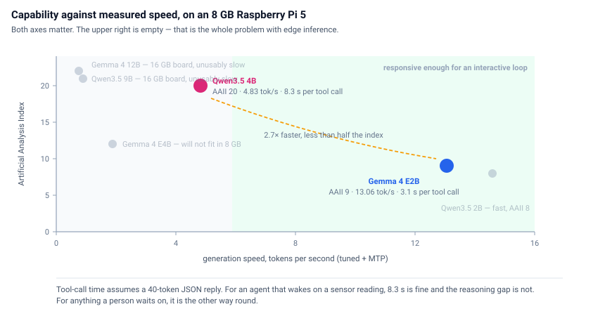
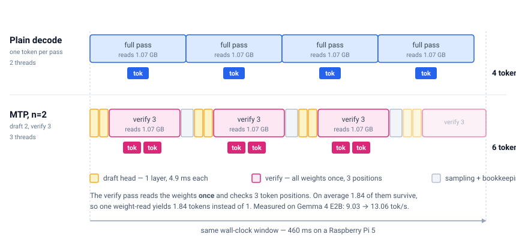
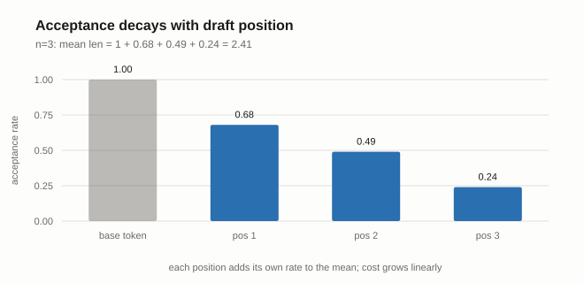
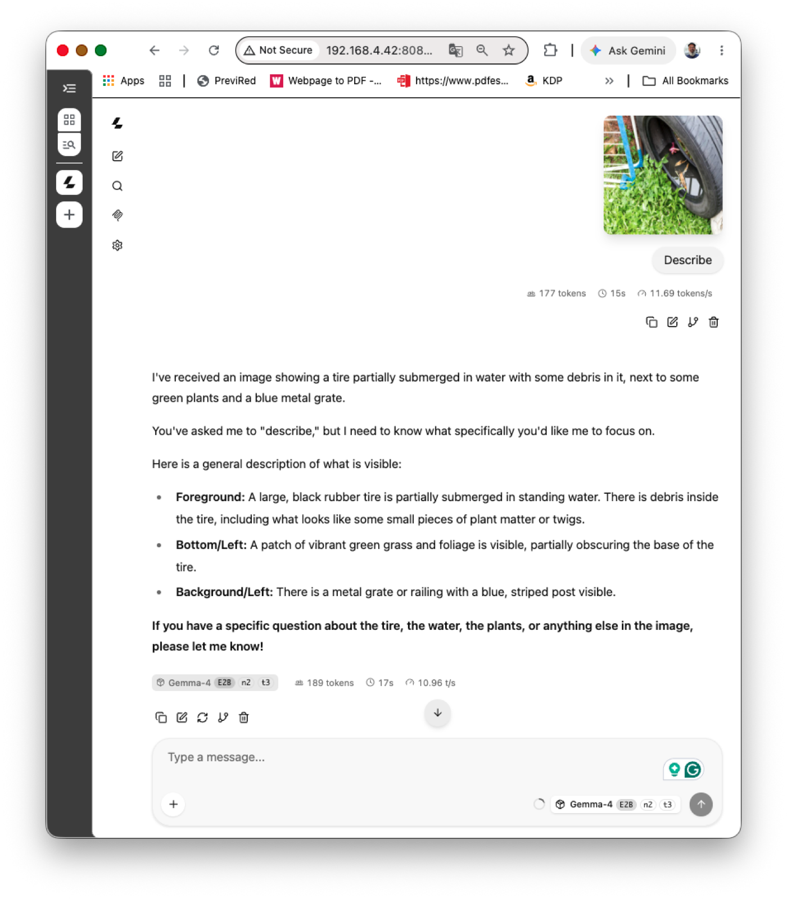
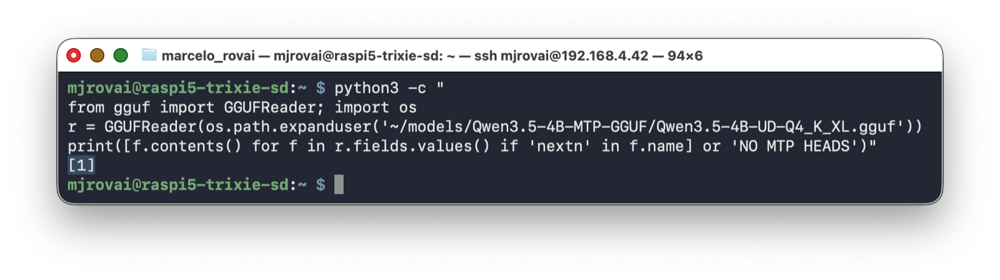
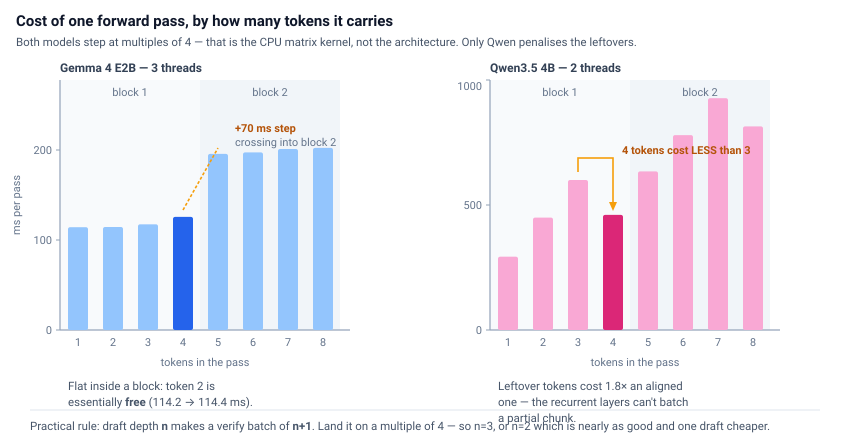
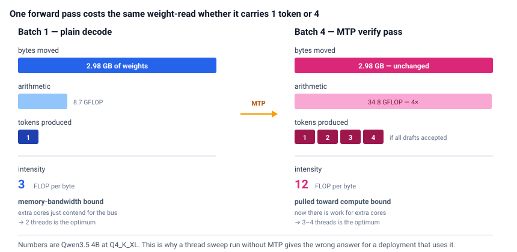
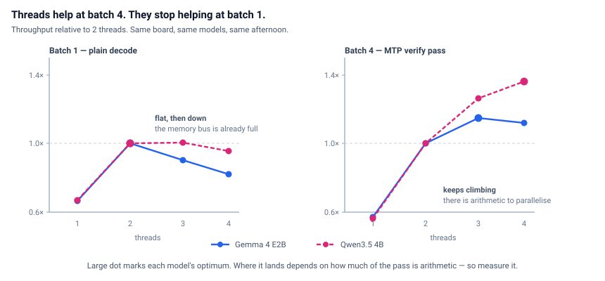
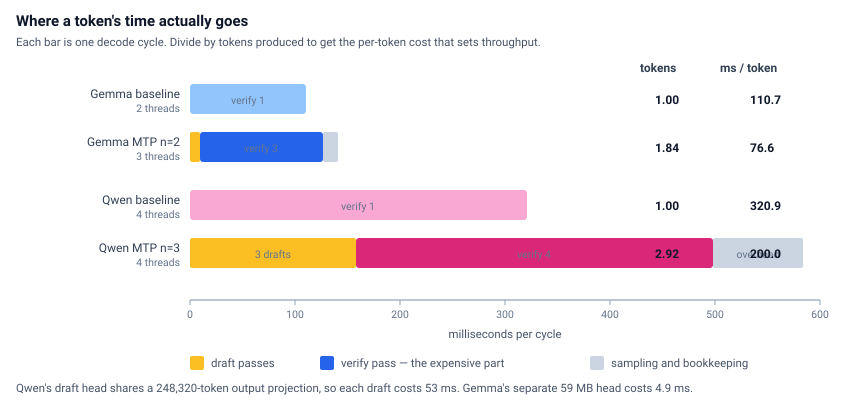

## Introduction

An 8 GB Raspberry Pi 5 will run a modern small language model offline, with no cloud call and no GPU. It will not run it quickly. The question this chapter answers is how close you can get to the hardware's limit, and what you give up at each setting.

Two models are worth your time on this board. **Gemma 4 E2B** is the fast one — around 13 tokens per second (MTP, vision and sound) once tuned. **Qwen3.5 4B** is the capable one, scoring more than twice as high on the Artificial Analysis index, and it runs at about 3 (no MTP, vision) or 5 (with MTP, no vision). Everything else in the current generation either doesn't fit in 8 GB or decodes slowly enough that you close the terminal.

Both ship with **multi-token prediction** (MTP): a small purpose-trained head that proposes the next few tokens so the base model can verify several at once instead of generating them one at a time. On a GPU this reliably buys 1.4× to 2×. **On a Pi it buys about 1.5×** — but only at one narrow setting, and the obvious knobs point the wrong way.

The measurements matter more than the numbers. A Pi throttles, its chat interfaces report throughput that isn't comparable across runs, and a single speculative-decoding measurement is far noisier than you'd expect. The method here transfers to any edge inference work you do next.

**Hardware:** Raspberry Pi 5 (8 GB), active cooler, Raspberry Pi OS Trixie 64-bit, llama.cpp build 10073 (`91d2fc387`).

> Every number below was measured on that setup, with repeats. Re-measure on yours — results move with the model, the thread count, and the llama.cpp build.

---

## 1. Which model

From the [Artificial Analysis leaderboard](https://artificialanalysis.ai/leaderboards/models):

| Model | Creator | Total params | Active | Context | AAII |
|---|---|---|---|---|---|
| Gemma 4 12B | Google | 12B | 12B | 256k | 22 |
| Qwen3.5 9B | Alibaba | 9B | 9B | 262k | 21 |
| **Qwen3.5 4B** | **Alibaba** | **4B** | **4B** | **262k** | **20** |
| Gemma 4 E4B | Google | ~8B (E4B) | ~4B eff. | 128k | 12 |
| **Gemma 4 E2B** | **Google** | **~5B (E2B)** | **~2B eff.** | **128k** | **9** |
| Qwen3.5 2B | Alibaba | 2B | 2B | 262k | 8 |
| Qwen3.5 0.8B | Alibaba | 0.8B | 0.8B | 262k | 5 |

The 12B and the 9B load on a 16 GB Pi and are unusable in practice. Gemma 4 E4B won't fit in 8 GB at all. That leaves the two in bold, and here is what they actually do on this board:

| | Gemma 4 E2B | Qwen3.5 4B |
|---|---|---|
| AAII | 9 | 20 |
| File size (Q4_K_XL) | 2.43 GiB | 2.78 GiB |
| Baseline | 9.03 tok/s | 3.12 tok/s |
| Tuned, with MTP | **13.06 tok/s** | **4.83 tok/s** |
| MTP gain | 1.45× | 1.55× |
| Best config | n=2, 3 threads | n=3, 4 threads |
| 40-token tool call | 3.1 s | 8.3 s |



E2B is a model for narrow tasks — classify this reading, fill this schema, answer from this retrieved paragraph. Ask it to reason across a chain, and it produces something confident and wrong. Qwen3.5 4B holds a short chain of reasoning and picks tools more reliably. Section 6 has the decision in detail; if you want one sentence, it's that the speed gap matters less than it looks once your workload stops being interactive.

---

## 2. Setup

### Build llama.cpp

Already installed? Update:

```bash
cd ~/llama.cpp && git pull
cmake -B build -DCMAKE_BUILD_TYPE=Release -DGGML_NATIVE=ON
cmake --build build -j4
```

From scratch:

```bash
sudo apt update
sudo apt install -y build-essential cmake git libcurl4-openssl-dev
git clone https://github.com/ggml-org/llama.cpp
cd llama.cpp
cmake -B build -DCMAKE_BUILD_TYPE=Release -DGGML_NATIVE=ON
cmake --build build -j4
```

No CUDA, no Metal. The Pi 5's VideoCore VII has a Vulkan backend in llama.cpp, but for LLM decode it has been slower than the CPU path in every report I've seen. `--n-gpu-layers 0` is the right setting, not a limitation you're working around.

`-DGGML_NATIVE=ON` targets the Cortex-A76 directly and picks up NEON, dotprod, and fp16 arithmetic. The A76 has no SVE and no SME, so the log lines you'd see on Apple Silicon won't appear here.

Build takes 15–25 minutes. Use `-j4`, not `-j$(nproc)` with anything higher — four cores and 8 GB will start swapping on the heavier translation units.

Check the build number:

```bash
~/llama.cpp/build/bin/llama-server --version
```

MTP support for these architectures landed around build 10000. Anything near 10073 is current enough.

### Thermals

A Pi 5 under sustained inference hits the throttle point without active cooling, and it does it silently — throughput decays over a couple of minutes with no error. Benchmark without watching temperature, and your numbers depend on how long ago you started.

In a second SSH session:

```bash
watch -n 2 'vcgencmd measure_temp; vcgencmd get_throttled'
```

Anything other than `0x0` from `get_throttled` means the run is invalid. Let it cool and start over.

Before any measurement:

```bash
sudo cpufreq-set -g performance 2>/dev/null || echo "using default governor"
free -h
swapon --show
```

If swap is being touched during inference, you're measuring storage latency. Raspberry Pi OS defaults to zram — compressed RAM rather than disk — so the cost is CPU cycles spent compressing, competing with your inference threads. Both models fit in RAM on an 8 GB board. Check rather than assume.

### SD card or SSD

llama.cpp mmaps the model, so weights land in page cache and stay there. Storage speed affects **load time**, not decode throughput. A 3 GB model off NVMe takes a few seconds, off an A2 card a minute or more, and the same tok/s afterward.

That holds as long as the weights stay cached. Open a browser mid-benchmark, and the kernel starts evicting cached weight pages, which then get re-read during inference. On NVMe you barely notice; on a card, throughput collapses in a way that looks like random slowness. **Run headless**, and if you're on a card, watch the `buff/cache` figure in `free -h` during a sweep.

---

## 3. Gemma 4 E2B — the fast one

### Download

Three files: the base model, the MTP head (59 MB), and the multimodal projector if you want vision.

```bash
pip install -U "huggingface_hub[cli]" --break-system-packages

hf download unsloth/gemma-4-E2B-it-qat-GGUF \
    --local-dir ~/models/gemma-4-E2B-qat-it-GGUF \
    --include "*mmproj-F16*" --include "mtp-*" --include "*UD-Q4_K_XL*"

ls -lh ~/models/gemma-4-E2B-qat-it-GGUF
```

The **QAT** variant is quantization-aware trained, so 4-bit costs less accuracy than post-training quantization would. **UD-Q4_K_XL** is Unsloth's dynamic quantization — better accuracy preservation than plain Q4_0, and sometimes smaller.

You need at least the base GGUF and the `mtp-` prefixed file. If the MTP file isn't there, check for a subfolder.

### Run it

```bash
G=~/models/gemma-4-E2B-qat-it-GGUF

~/llama.cpp/build/bin/llama-server \
  --model       $G/gemma-4-E2B-it-qat-UD-Q4_K_XL.gguf \
  --model-draft $G/mtp-gemma-4-E2B-it.gguf \
  --spec-type draft-mtp --spec-draft-n-max 2 \
  --threads 3 --ctx-size 8192 --parallel 1 \
  --flash-attn on --n-gpu-layers 0 \
  --temp 1.0 --top-p 0.95 --top-k 64 \
  --reasoning off --reasoning-budget 0 \
  --tools all --host 0.0.0.0 --port 8080 \
  --alias Gemma-4-E2B-n2-t3
```

`--threads 3`. Not 2, and not 4. Section 5 explains why, and why the answer is different without MTP.

`--spec-draft-n-max 2`. Draft depth 2, giving a verify batch of 3. n=3 is within 2%; both sit at the top of a plateau, and n=4 and beyond are *worse than not using MTP at all*.

`--tools all` enables function calling. Without it the `tools` array in a request is silently dropped.

`--host 0.0.0.0` so you can reach the WebUI from a laptop. llama-server's own startup warning is worth heeding once tools are on: don't expose it past a trusted LAN.

Open `http://<pi-address>:8080`, and turn on *Show message generation statistics* under Settings.

### Results

Draft depth `n` produces a verify batch of `n+1` — the drafts plus the model's own next token. Three threads, three runs per row:

| n | batch | tok/s | vs baseline | mean accepted |
|---|---|---|---|---|
| 0 (no MTP) | 1 | 9.03 | — | 1.00 |
| **2** | 3 | **13.06** | **1.45×** | 1.84 |
| **3** | 4 | **12.90** | 1.43× | 2.04 |
| 4 | 5 | ~7.9 | 0.87× | 2.22 |
| 7 | 8 | ~7.4 | 0.82× | 2.29 |



**A plateau and a cliff.** n=2 and n=3 sit together at the top. n=4 falls off a ledge and never recovers. The most useful result here is the negative one: past a threshold, more speculation is actively harmful.

n=3 accepts 11% more tokens per cycle than n=2 and costs 12% more to run, which is why they tie. Use either. n=2 is marginally ahead, and one draft pass cheaper.

### Reading acceptance

At `--log-verbosity 4`, llama.cpp prints the per-position breakdown:

```
draft acceptance = 0.37, mean len = 2.10
     acc per pos = (0.68, 0.49, 0.24)
```

Position 1 is accepted 68% of the time, position 2 49%, position 3 24%. Mean accepted length is just the sum plus one: 1 + 0.68 + 0.49 + 0.24 ≈ 2.4.

That identity is the clearest teaching artifact in the whole exercise. Each extra draft position contributes its own acceptance rate, and those rates decay fast — roughly halving each step — while the cost of the wider batch does not decay at all. You pay for positions that mostly get thrown away.



### MTP is lossless — verified

At `--temp 0`, n=0, n=2, and n=3 produced byte-identical output: same md5, same 239 tokens, all three running to EOS rather than hitting the length cap.

```bash
# same server, --temp 0 --top-k 1 --min-p 0 --top-p 1.0, md5 the content field
a23acfdf4c15715d82afc9fa75d34de6   239 tokens   n=0   8.77 tok/s
a23acfdf4c15715d82afc9fa75d34de6   239 tokens   n=2  12.83 tok/s
a23acfdf4c15715d82afc9fa75d34de6   239 tokens   n=3  11.91 tok/s
```

Same text, 46% faster. Worth being precise about what "lossless" means, though, because it differs by temperature:

- **Greedy (temp 0): output-identical.** The verify step either accepts the draft token or replaces it with the target model's own argmax.
- **Sampled (temp > 0): distribution-preserving, not output-identical.** Rejection sampling guarantees the same output distribution, but a rejected draft advances the random stream differently than a plain decode step. Same seed, different text, at different draft depths. That's expected behaviour, not a bug.

### Vision

Add `--mmproj mmproj-F16.gguf`. 

```bash
G=~/models/gemma-4-E2B-qat-it-GGUF

~/llama.cpp/build/bin/llama-server \
  --model       $G/gemma-4-E2B-it-qat-UD-Q4_K_XL.gguf \
  --mmproj      $G/mmproj-F16.gguf
  --model-draft $G/mtp-gemma-4-E2B-it.gguf \
  --spec-type draft-mtp --spec-draft-n-max 2 \
  --threads 3 --ctx-size 8192 --parallel 1 \
  --flash-attn on --n-gpu-layers 0 \
  --temp 1.0 --top-p 0.95 --top-k 64 \
  --reasoning off --reasoning-budget 0 \
  --tools all --host 0.0.0.0 --port 8080 \
  --alias Gemma-4-E2B-n2-t3
```

 It works alongside MTP on Gemma. One image — a discarded tire holding standing water — with a short prompt, at n=2 and three threads:



| phase | tokens | time | rate |
|---|---|---|---|
| prompt (incl. 169 image tokens) | 177 | 15 s | 11.69 t/s |
| decode | 189 | 17 s | 10.96 t/s |

Two things before you plan a vision workload.

**The prompt phase is where the cost is.** A vision prompt runs at 85.5 ms per token against 24.0 ms for text on the same server — 3.6× more expensive. And MTP does nothing for it; speculation only accelerates decode. A single tok/s figure for a vision request hides which half you sped up, so report the two phases separately.

**Decode slows with accumulated context.** 10.96 t/s here against 13.06 on a fresh prompt, at identical acceptance (mean accepted length 1.89 versus 1.84). The difference is 1,500 tokens of conversation history, not the image.

---

## 4. Qwen3.5 4B — the capable one

### Download

The MTP head is embedded in the model file here, so there's only one file to fetch. Note the repo name carries the `MTP` marker; the filenames don't.

```bash
hf download unsloth/Qwen3.5-4B-MTP-GGUF \
    --local-dir ~/models/Qwen3.5-4B-MTP-GGUF \
    --include "*UD-Q4_K_XL*"
```

Verify the prediction heads are actually present before spending time on it — a standard GGUF will load fine and silently ignore `--spec-type`:

```bash
python3 -m pip install --break-system-packages gguf
python3 -c "
from gguf import GGUFReader; import os
r = GGUFReader(os.path.expanduser('~/models/Qwen3.5-4B-MTP-GGUF/Qwen3.5-4B-UD-Q4_K_XL.gguf'))
print([f.contents() for f in r.fields.values() if 'nextn' in f.name] or 'NO MTP HEADS')"
```

You want `qwen35.nextn_predict_layers = 1`.



### Run it

```bash
Q=~/models/Qwen3.5-4B-MTP-GGUF

~/llama.cpp/build/bin/llama-server \
  --model $Q/Qwen3.5-4B-UD-Q4_K_XL.gguf \
  --spec-type draft-mtp --spec-draft-n-max 3 --spec-draft-n-min 0 \
  --threads 4 --ctx-size 8192 --parallel 1 \
  --flash-attn on --kv-unified \
  --temp 0.6 --top-p 0.95 --top-k 20 --min-p 0 \
  --reasoning off --reasoning-budget 0 \
  --jinja --host 0.0.0.0 --port 8081 \
  --alias Qwen3.5-4B-n3-t4
```

No `--model-draft` — the head is in the file.

`--min-p 0` explicitly. The server injects 0.05 otherwise, which changes acceptance and makes your runs non-comparable with anyone else's.

`--threads 4` and `--spec-draft-n-max 3`. Both differ from Gemma's answer, and both differ from the published guidance. More on that in section 5.

Two flags that fail on `llama-cli`: `--kv-unified` and `--parallel` are server-only in this build.

### Results

| n_max | batch | tok/s | mean accepted |
|---|---|---|---|
| 0 (no MTP) | 1 | 3.12 | 1.00 |
| 1 | 2 | 3.09 | 1.78 |
| 2 | 3 | **2.87** | 2.41 |
| **3** | **4** | **4.83** | **2.92** |
| 7 | 8 | 2.26 | 3.17 |

Look at n=2. It drafts more than n=1 and accepts a higher fraction, and it's *slower*. That isn't an acceptance effect — it's the verify pass, whose cost is not monotonic in batch width. Section 5 explains it.

**Unsloth recommends n-max 2 for dense models. On Qwen3.5 4B, that is the worst available setting**, 31% slower than n=3.

### The architecture is not a plain transformer

Worth knowing, because it explains the odd behaviour:

```
qwen35.block_count             = 33      (32 layers + 1 nextn head)
qwen35.full_attention_interval = 4
qwen35.ssm.conv_kernel         = 4
llama_kv_cache:         256.00 MiB (8192 cells,  8 layers)
llama_memory_recurrent: 150.75 MiB (   1 cells, 32 layers)
```

Eight of 32 layers do full attention. The other 24 are Gated DeltaNet with recurrent state — constant size regardless of context length, which is why the KV cache is only 256 MiB at 8k where a dense 4B would need several times more.

Practical consequences: context is cheap, and a partial batch is expensive. Both show up in section 5.

### Context depth

Verify cost against prompt depth, batch 4:

| depth | 0 | 512 | 2048 | 4096 |
|---|---|---|---|---|
| ms per pass | 356 | 366 | 462 | 614 |

Flat to 512, then about 69 µs per token of depth. A sensor-triggered agent with a 200-token prompt never leaves the flat region. It matters if you accumulate conversation history.

That decay is attention arithmetic, not KV cache traffic — at 32 KiB per token across 8 layers, depth 2048 is only 67 MB of reads, worth about 7 ms. And with only 8 of 32 layers contributing, a dense 4B would decay roughly four times faster.

### Not yet supported with MTP

`--mmproj` and `--parallel > 1`. A vision workload needs a second server instance without `--spec-type`, running at 3.12 tok/s.

---

## 5. Three rules that came out of both models

### Rule 1 — tune the verify batch, not the draft depth

Draft depth `n` creates a verify batch of `n+1`. The cost of that batch is what sets throughput, and it is not a smooth function of width.

`llama-bench` measures it directly. It can't run speculative decoding — there's an open feature request — but it can time a forward pass at any batch width, which is exactly what the verify pass is:

```bash
~/llama.cpp/build/bin/llama-bench -m $MODEL \
  -t 3 -fa on -p 1,2,3,4,5,6,7,8 -n 0 -r 20 --delay 5 -o md
```

Convert throughput to per-pass latency with `t(N) = N / pp_N`:



Both models step at multiples of 4. Inside a block the cost is nearly flat — on Gemma at three threads, a second token in the pass is *free* (114.2 ms against 114.4). Cross a block boundary and you pay a step of 70 ms.

Since the period-4 structure appears in a dense model and a hybrid one alike, it belongs to the CPU matrix kernel — llamafile or KleidiAI, both active in this build — not to either architecture.

What is Qwen-specific is the penalty on leftovers. Gemma's remainder tokens cost almost nothing extra; Qwen's cost 1.8× an aligned token, and at two threads that makes batch 4 *cheaper in absolute time* than batch 3. That's the recurrent layers: an incomplete chunk can't use the chunked scan and falls back to walking tokens one at a time.

> **Pick `n` so that `n+1` lands on a multiple of 4.** That means n=3, or n=2 which is one draft cheaper and usually within noise. Not the acceptance-decay reasoning that governs GPU deployments.

### Rule 2 — measure threads at the batch width you'll deploy at



A batch-1 pass reads all the weights and does relatively little arithmetic — about 3 FLOP per byte moved. The memory bus saturates at two cores and extra threads only contend for it. A batch-4 verify pass reads the *same* weights and does four times the arithmetic, around 12 FLOP per byte. Now there's work for more cores.



| | plain decode | with MTP |
|---|---|---|
| Gemma 4 E2B | 2 threads (9.03 vs 8.73) | 3 threads (+11%) |
| Qwen3.5 4B | 2 threads | 4 threads (+16%) |

Where the optimum lands depends on how much of the pass is arithmetic. Gemma's batch-4 pass is about a third compute; Qwen's is nearly half, so Qwen keeps gaining out to four threads while Gemma stops at three.

> A thread sweep run without MTP answers a question about batch 1. If you then deploy at batch 4, you have optimised the wrong thing.

### Rule 3 — the interface is not a benchmark

Three surfaces report throughput and they disagree.

The **WebUI** carries conversation history and template scaffolding. Every follow-up turn resends accumulated context, which lengthens the prompt and suppresses acceptance. Testing MTP this way can show no benefit at all when the API shows 1.45×.

The **`llama-cli` TUI** in recent builds prints a tok/s badge and *no* `eval time` line. Its badge declined monotonically within a session in my runs — 4.8 down to 3.0 at two threads. It's also the default surface most readers will land on.

The **server's `eval time`**, or the `timings` object from a `/completion` call, is the number to trust.

```bash
curl -s http://localhost:8080/completion -H 'Content-Type: application/json' \
  -d '{"prompt":"Explain photosynthesis in 300 words.","n_predict":256,"cache_prompt":false}' \
  | python3 -c "import json,sys; print(json.load(sys.stdin)['timings']['predicted_per_second'])"
```

And run it three times. **Speculative throughput is far noisier than plain decode** — baseline standard deviation was 0.6%, MTP 5.5%, nine times wider. That's inherent: MTP's cost per token divides by an acceptance rate that depends on what text happens to get generated.

There's a trick that removes the noise entirely. Divide by the accepted length and you get cycle time, which is a property of the machine rather than the text:

| Gemma n=3, t=3 | tok/s | mean len | cycle |
|---|---|---|---|
| seed 43 | 13.94 | 2.20 | 157.8 ms |
| seed 44 | 11.94 | 1.88 | 157.5 ms |
| seed 45 | 12.81 | 2.04 | 159.2 ms |

Throughput spans 17%. Cycle time spans 1%. When comparing configurations, compare cycle times.



---

## 6. Choosing between them

Qwen3.5 4B is 2.7× slower and scores more than twice as high on the index. The index isn't linear, and I wouldn't read 20-against-9 as "twice as good," but the gap is real: it's the difference between a model that fills a fixed schema and one that decides which tool to call. Note that with MTP, Qwen is only for text. 

The part that surprised me is how little the speed difference matters once the workload stops being interactive. Nobody watches either of these stream an essay. What you care about is time to complete a tool call — 40 tokens of JSON — and there it's 3.1 seconds against 8.3. Both are fine for an agent that wakes on a sensor reading a few times an hour. Both are hopeless for chat.

So the calculus flips depending on who's waiting:

**Use Gemma 4 E2B** when the task is narrow and the loop is tight. Classify this reading. Is there standing water in this frame. Emit this schema. Also when you need vision, since MTP and `--mmproj` work together here and don't on Qwen.

**Use Qwen3.5 4B** when the model has to choose among tools, reason over a retrieved paragraph, or produce output whose shape isn't fixed in advance. Also when context is long, because the hybrid architecture makes context unusually cheap.

The dengue demo uses both, and that isn't hedging. The vision pass is a classification; the triage decision is a judgment.

### A measured ceiling

Qwen reads 2.98 GB of weights per token at 3.12 tok/s — **9.3 GB/s achieved**, against 17.1 GB/s theoretical for the Pi 5's 32-bit LPDDR4X-4267. About 54% efficiency, which is ordinary for real workloads and a better teaching number than a spec sheet.

Gemma gives the same figure by contradiction. Its file is 2.61 GB, and it decodes at 9.03 tok/s, which would require 23.5 GB/s — above the theoretical ceiling, so it cannot be happening. E2B demonstrably does not read all its weights per token. At 9.3 GB/s it touches about 1.07 GB, roughly 41% of the file. That's MatFormer nesting and per-layer embeddings doing real work, proven from outside the model rather than taken from the card.

---

## 7. How this was measured

Every command ran on my own Pi. I pasted raw terminal output into a working session with Claude, which read the logs, proposed the next test, wrote the harness scripts, and drafted prose. The judgment stayed mine; so did the hardware and the final call on every claim.

The corrections are in the text rather than edited out, because a tutorial that shows only the tidy path teaches less than one that shows a wrong guess meeting a measurement:

- The first advice I got was that CPU threads scale near-linearly to core count. At batch 1 they don't, and my own sweep contradicted it. Then the *opposite* advice — two threads, always — turned out to be wrong for the batch-4 verify pass. The rule that survived is neither, and it took both models to find it.
- A clean kernel-alignment mechanism was proposed from one noisy sweep, then had to be retracted and split into two separate effects once the second model was measured.
- A falsifiable prediction about draft depths 4 through 7 was made and immediately falsified by data I'd already collected.

Three separate times, a benchmark produced comparable-looking numbers from a non-comparable configuration: a hardcoded thread count inside a function, omitted sampling flags that silently changed acceptance, and a path typo that loaded nothing. **Pin every parameter you intend to compare across, including the ones you assume are defaults.**

---

## 8. What to take away

**MTP works on a Pi, at one narrow setting.** About 1.45× on Gemma (n=2, three threads) and 1.55× on Qwen (n=3, four threads). Depths of 4 and beyond are slower than not using MTP at all.

**Tune the verify batch, not the draft depth.** `n+1` should land on a multiple of 4. This is a property of the CPU matrix kernel and it holds across both architectures.

**Thread count follows batch width.** Two threads for plain decode, three or four with MTP. Measure at the width you deploy at.

**Everything is the memory wall — until it isn't.** 9.3 GB/s achieved against 17.1 theoretical, and the reason MTP helps at all is that it decouples tokens-committed from weight-reads. But the moment you batch four tokens into a pass, the bottleneck moves and the tuning advice inverts. That inversion is the single most useful thing in this chapter.

**Trust the API, repeat three times, compare cycle times.** Chat interfaces measure themselves along with the model.

**These aren't chat models, and that's fine.** At 5 to 13 tok/s nobody wants to watch an essay stream out. A sensor-triggered agent that emits forty tokens of JSON in three to eight seconds, offline, on a board costing less than a textbook — that's a real deployment, and it's what this hardware is for. Benchmark the tool-call path, not the essay.

---

## Resources

**Models**

- [Gemma 4 E2B QAT GGUF (Unsloth)](https://huggingface.co/unsloth/gemma-4-E2B-it-qat-GGUF) — base model, MTP head, and mmproj
- [Qwen3.5 4B MTP GGUF (Unsloth)](https://huggingface.co/unsloth/Qwen3.5-4B-MTP-GGUF) — MTP-enabled weights; the plain repo won't work
- [Unsloth MTP documentation](https://unsloth.ai/docs/models/mtp) — memory tables and per-model notes

**Tools**

- [llama.cpp](https://github.com/ggml-org/llama.cpp) — build 10073 or newer for these architectures
- [llama.cpp speculative decoding docs](https://github.com/ggml-org/llama.cpp/blob/master/docs/speculative.md) — `--spec-type` and the draft flags

**Background**

- Leviathan et al., *Fast Inference from Transformers via Speculative Decoding* (2023) — the method MTP builds on
- [Artificial Analysis leaderboard](https://artificialanalysis.ai/leaderboards/models) — the AAII scores in section 1

---

## Appendix A: reproducing the headline numbers

Both models, baseline and MTP, through the same harness. Interleave the conditions so heat can't align with configuration.

```bash
P='{"prompt":"Explain photosynthesis in 300 words.","n_predict":256,"cache_prompt":false}'

run () {   # $1 = label   $2 = extra server args   $3 = threads
  ~/llama.cpp/build/bin/llama-server --model $MODEL $2 \
    -t $3 -c 8192 -np 1 -fa on --n-gpu-layers 0 \
    --host 127.0.0.1 --port 8081 -lv 4 > /tmp/r_$1.log 2>&1 &
  until curl -sf http://127.0.0.1:8081/health >/dev/null 2>&1; do sleep 1; done
  printf "%-12s " "$1"
  curl -s http://127.0.0.1:8081/completion -H 'Content-Type: application/json' -d "$P" \
    | python3 -c "import json,sys; print(round(json.load(sys.stdin)['timings']['predicted_per_second'],3))"
  grep -oE "mean len = +[0-9.]+" /tmp/r_$1.log | tail -1
  pkill -f llama-server; sleep 15
}

for i in 1 2 3; do
  run "base$i" "--spec-type none" 2
  run "mtp$i"  "--spec-type draft-mtp --spec-draft-n-max 2 --spec-draft-n-min 0 --model-draft $G/mtp-gemma-4-E2B-it.gguf" 3
done
```

Check `vcgencmd get_throttled` afterward. Anything but `0x0` invalidates the run.

## Appendix B: what's still open

**The depth-sweep variance.** The same binary and configuration produced ±0.04 in one llama-bench run and ±1.58 in another, on a board that started at 48.8 °C. Not thermal, and unexplained.

**Whether the block boundary moves at four threads on Gemma.** Measured at two and three; both put it at 4.

**Cross-harness baselines.** A `/v1/chat/completions` call and a raw `/completion` call gave baselines about 5% apart, probably chat-template overhead. Pick one and derive every number in it.
